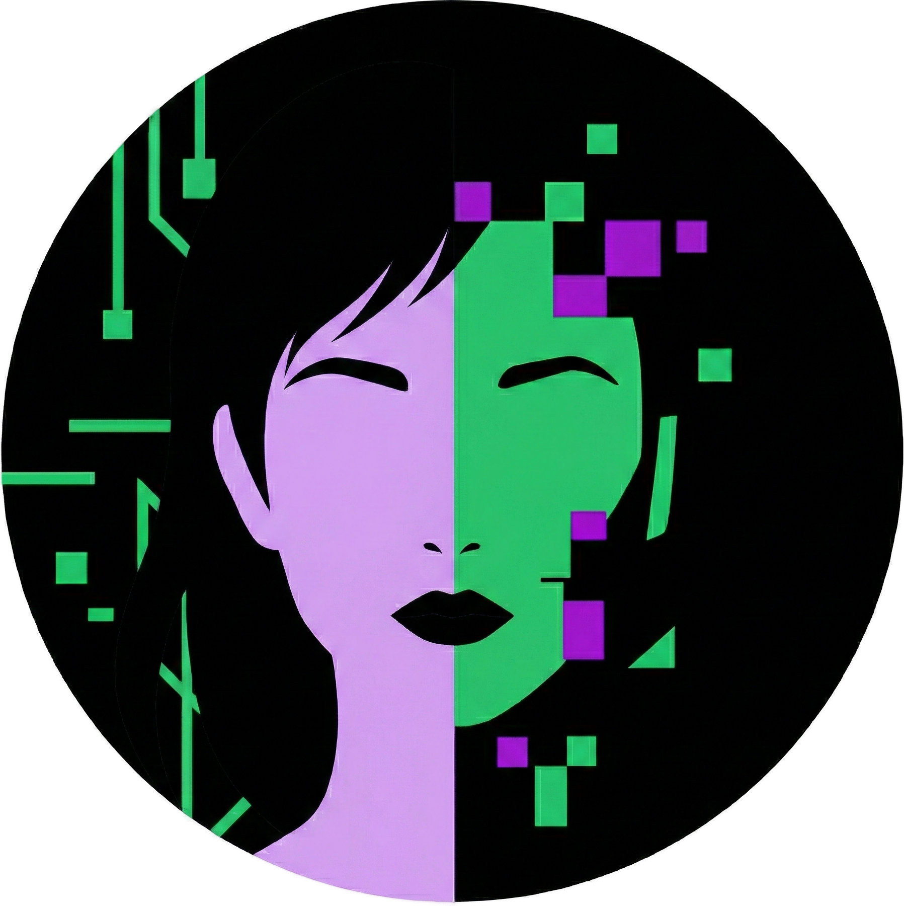

<div align="center">

```
██▓███ ██▀███  ▒█████      ██  ▓████ █████ ▒█████    ██▓     █   ██ ███▄    █  ▄▄▄░░
██░  ████ ▒ ██ ██▒  ██    ▒██  ▓█     ██▒  ██▒  ██   ██▒     █  ▓██ ██ ▀█   █ ▒████▄
██░ ██▓██ ░▄█  ██░  ██    ░██  ▒███   ██░  ██░  ██   ██░     █  ▒██ ██  ▀█ ██▒▒██  ▀█▄
██▄█▓▒ ██▀▀█▄  ██   ██ ▓██▄██  ▒▓  ▄  █▓   ██   ██   ██░     █  ░██ ██▒  ▐▌██▒░██▄▄▄▄█
██▒ ░  ██▓ ▒██  ████▓░  ████▒  ░▒██▒  █▒    ████▓    ██████▒ █████▓ ██░   ▓██░ ▓█   ▓█

```


[](#)
[](LICENSE)
[](https://www.python.org/)
[](#)
[](https://github.com/AndreBFarias/Luna/actions/workflows/ci.yml)
[](#desenvolvimento)
[](#desenvolvimento)
[](#pantheon)
[](#docker)
[](CONTRIBUTING.md)



**Assistente multimodal com interface terminal, voz, visao e personalidade propria.**

[Instalacao](#instalacao) | [Ambiente Dev](#ambiente-de-desenvolvimento) | [Entendendo o Projeto](#entendendo-o-projeto) | [Uso](#uso) | [Pantheon](#pantheon) | [Contribuir](#contribuir)

</div>

---

## O que e Luna?

Luna e uma assistente com identidade visual e comportamental unica. Funciona inteiramente no terminal com interface rica (TUI), suporta conversas por texto ou voz, enxerga atraves da webcam, e mantem memoria persistente entre sessoes.

**Diferenciais:**
- **Offline-first**: Funciona 100% local com modelos open-source
- **Multi-personalidade**: 6 entidades com identidades distintas (Pantheon)
- **Estetica gotica**: Animacoes ASCII, tema Dracula, experiencia imersiva
- **Memoria vetorial**: Lembra de conversas anteriores com busca semantica
- **Open source**: GPLv3, sem telemetria, sem dependencia de cloud

---

## Instalacao

### Linux (Recomendado)

```bash
# 1. Clonar repositorio
git clone https://github.com/AndreBFarias/Luna.git
cd Luna

# 2. Tornar instalador executavel
chmod +x install.sh

# 3. Executar instalador
./install.sh

# 4. Configurar API (opcional para modo online)
cp .env.example .env
nano .env  # Editar GOOGLE_API_KEY se quiser usar Gemini

# 5. Iniciar
./run_luna.sh
# ou: python main.py
```

### Windows

```powershell
# 1. Clonar repositorio
git clone https://github.com/AndreBFarias/Luna.git
cd Luna

# 2. Executar instalador (como Administrador)
install.bat

# 3. Configurar API
copy .env.example .env
notepad .env  # Editar GOOGLE_API_KEY

# 4. Iniciar
run_luna.bat
# ou: venv\Scripts\activate && python main.py
```

### Docker

```bash
# Build e execucao
docker compose up --build

# Com Ollama sidecar
docker compose --profile with-ollama up
```

### Requisitos

| Componente | Minimo | Recomendado |
|------------|--------|-------------|
| Python | 3.10 | 3.11+ |
| RAM | 8GB | 16GB |
| GPU | - | NVIDIA 4GB+ |
| Sistema | Linux/Windows | Pop!_OS/Ubuntu |

### Dependencias de Sistema (Linux)

```bash
# Ubuntu/Pop!_OS
sudo apt install portaudio19-dev ffmpeg tesseract-ocr scrot xdotool \
    python3-dev python3-venv libcairo2-dev pkg-config espeak-ng

# Fedora
sudo dnf install portaudio-devel ffmpeg tesseract xdotool \
    python3-devel cairo-devel espeak-ng
```

### Assets Adicionais (Voice Models)

Os modelos de voz sao grandes (~5.5GB total) e nao estao incluidos no repositorio.
Eles sao baixados automaticamente pelo instalador ou podem ser obtidos manualmente:

```bash
# Download automatico (recomendado)
./scripts/download_assets.sh

# Ou download manual via GitHub Releases
# https://github.com/AndreBFarias/Luna/releases/tag/v3.6.0-assets
```

**Estrutura dos assets:**

| Asset | Tamanho | Descricao |
|-------|---------|-----------|
| `voice-models-female.tar.gz` | 84MB | Referencias Luna, Eris, Juno |
| `voice-lars.tar.gz` | 1.7GB | Modelo treinado Lars |
| `voice-mars.tar.gz` | 1.7GB | Modelo treinado Mars |
| `voice-somn.tar.gz` | 1.7GB | Modelo treinado Somn |

**Nota:** O projeto funciona sem os voice models - usara TTS do sistema como fallback.

---

## Ambiente de Desenvolvimento

Esta secao ensina como configurar seu ambiente para contribuir com o projeto.

### 1. Fork e Clone

```bash
# Fork pelo GitHub (botao "Fork" no canto superior direito)

# Clone seu fork
git clone https://github.com/SEU_USUARIO/Luna.git
cd Luna

# Adicione o repositorio original como upstream
git remote add upstream https://github.com/AndreBFarias/Luna.git

# Verifique os remotes
git remote -v
# origin    https://github.com/SEU_USUARIO/Luna.git (fetch)
# origin    https://github.com/SEU_USUARIO/Luna.git (push)
# upstream  https://github.com/AndreBFarias/Luna.git (fetch)
# upstream  https://github.com/AndreBFarias/Luna.git (push)
```

### 2. Configurar GitHub CLI (Recomendado)

```bash
# Instalar gh CLI
# Linux
sudo apt install gh
# ou: https://cli.github.com/

# Autenticar
gh auth login
# Escolha: GitHub.com > HTTPS > Login with browser

# Verificar autenticacao
gh auth status
```

### 3. Instalar Dependencias de Dev

```bash
# Executar instalador
./install.sh

# Ativar ambiente
source venv/bin/activate

# Instalar pre-commit hooks
pip install pre-commit
pre-commit install

# Verificar instalacao
python src/tools/verify_install.py
```

### 4. Estrategia de Branches (Git Flow)

O projeto usa duas branches principais:

```
main (producao)          dev (desenvolvimento)
     │                         │
     │  ←─── PR aprovado ────  │
     │                         │
     │                    feat/xyz ─┐
     │                         │    │ desenvolvimento
     │                    feat/abc ─┘
     │                         │
     ▼                         ▼
  Releases                CI/Testes
```

| Branch | Proposito | Protegida? |
|--------|-----------|------------|
| `main` | **Producao estavel**. Apenas codigo testado e aprovado. | Sim |
| `dev` | **Desenvolvimento ativo**. Features em andamento. | Nao |
| `feat/*` | Features individuais. Merge para `dev`. | Nao |
| `fix/*` | Correcoes de bugs. Merge para `dev` ou `main` (hotfix). | Nao |

**Regras:**
- **Nunca commite direto em `main`** - sempre via PR
- Features novas: `feat/nome` -> PR para `dev`
- Bugs criticos: `fix/nome` -> PR para `main` (hotfix)
- Releases: `dev` -> PR para `main` apos testes

### 5. Fluxo de Trabalho Git

```bash
# Sincronizar com upstream antes de trabalhar
git fetch upstream
git checkout dev  # Trabalhe em dev, nao main
git merge upstream/dev

# Criar branch para sua feature
git checkout -b feat/minha-feature

# Fazer alteracoes...

# Commit (hooks vao rodar automaticamente)
git add .
git commit -m "feat: descricao da mudanca"

# Push para seu fork
git push origin feat/minha-feature

# Criar Pull Request para dev (nao main!)
gh pr create --base dev --title "feat: X" --body "Descricao detalhada"
```

### 6. Comandos Uteis

```bash
# Ver issues disponiveis
gh issue list --label "status:ready"

# Pegar uma issue para trabalhar
gh issue edit NUMERO --add-label "status:in-progress"

# Ver status do CI
gh run list

# Rodar testes localmente
pytest src/tests/ -v

# Rodar linter
ruff check src/

# Verificar imports
python -c "from src.app import TemploDaAlma; print('OK')"
```

---

## Entendendo o Projeto

**IMPORTANTE**: Antes de fazer qualquer alteracao, leia esta secao para entender a arquitetura.

### Ordem de Leitura Recomendada

```
1. README.md              <- Voce esta aqui
2. IMPORTANT.md           <- Padroes e regras do projeto
3. dev-journey/           <- Historia e decisoes de arquitetura
4. src/app/luna_app.py    <- Classe principal
5. config.py              <- Configuracoes globais
```

### Arquitetura Geral

```
┌─────────────────────────────────────────────────────────────┐
│                         main.py                             │
│                    (Orquestrador Minimo)                    │
└─────────────────────────┬───────────────────────────────────┘
                          │
        ┌─────────────────┼─────────────────┐
        │                 │                 │
        ▼                 ▼                 ▼
┌───────────────┐ ┌───────────────┐ ┌───────────────┐
│  Controllers  │ │     Soul      │ │      UI       │
│               │ │               │ │               │
│ ui_controller │ │ consciencia   │ │ banner        │
│ threading_ctl │ │ boca (TTS)    │ │ widgets       │
│ audio_ctl     │ │ visao         │ │ screens       │
└───────────────┘ │ memoria       │ │ entity_select │
                  └───────────────┘ └───────────────┘
                          │
                          ▼
                  ┌───────────────┐
                  │  Data Memory  │
                  │               │
                  │ smart_memory  │
                  │ vector_store  │
                  │ embeddings    │
                  └───────────────┘
```

### Estrutura de Pastas

```
Luna/
├── main.py              # Entry point (apenas 45 linhas)
├── config.py            # Configuracoes centralizadas
├── IMPORTANT.md         # Padroes e regras do projeto
├── src/
│   ├── app/             # Classe principal (TemploDaAlma)
│   │   ├── luna_app.py  # App Textual com mixins
│   │   ├── state_manager.py
│   │   ├── event_handlers.py
│   │   └── actions/     # Handlers de acoes
│   │
│   ├── controllers/     # Controladores extraidos
│   ├── soul/            # Motor de processamento
│   │   ├── consciencia.py  # Gerencia LLM
│   │   ├── boca.py         # TTS (Text-to-Speech)
│   │   ├── visao.py        # Processamento de imagem
│   │   └── memoria.py      # Memoria semantica
│   │
│   ├── ui/              # Interface TUI
│   ├── core/            # Nucleo (entity_loader, animation, etc)
│   ├── data_memory/     # Persistencia de dados
│   └── tests/           # Testes unitarios
│
├── dev-journey/         # Documentacao de desenvolvimento
├── Dockerfile           # Container
└── docker-compose.yml   # Orquestracao
```

### Modulos Principais

| Modulo | Responsabilidade |
|--------|------------------|
| `src/app/` | Interface principal (Textual TUI) |
| `src/soul/consciencia.py` | Processamento de linguagem |
| `src/soul/boca.py` | Sintese de voz (TTS) |
| `src/soul/visao.py` | Processamento de imagem |
| `src/core/entity_loader.py` | Carregamento de entidades |
| `src/data_memory/` | Persistencia e memoria vetorial |

### Fluxo de Processamento

```
Usuario digita/fala
        │
        ▼
┌───────────────┐
│ Input Handler │ (event_handlers.py)
└───────┬───────┘
        │
        ▼
┌───────────────┐
│ Consciencia   │ (consciencia.py)
│ - Contexto    │
│ - LLM Call    │
│ - Parsing     │
└───────┬───────┘
        │
        ├──────────────────┐
        │                  │
        ▼                  ▼
┌───────────────┐  ┌───────────────┐
│ Response      │  │ Animation     │
│ Pipeline      │  │ Controller    │
└───────┬───────┘  └───────────────┘
        │
        ▼
┌───────────────┐
│ Boca (TTS)    │ (se modo voz ativo)
└───────────────┘
```

### Dicas para Contribuidores

1. **Sempre leia o arquivo antes de editar** - Use `Read` tool
2. **Siga os padroes em IMPORTANT.md** - Commits, codigo, etc
3. **Teste localmente antes de PR** - `pytest src/tests/`
4. **Um commit por mudanca logica** - Facilita review
5. **Descreva o "porque" nos commits** - Nao apenas o "o que"

---

## Uso

### Controles

| Tecla/Botao | Acao |
|-------------|------|
| `Enter` | Enviar mensagem |
| `Voz` | Iniciar/parar chamada de voz |
| `Ver` | Capturar imagem da webcam |
| `+` | Anexar arquivo |
| `c` | Abrir configuracoes (Canone) |
| `h` | Ver historico de sessoes |
| `ESC` | Sair |

### Modo Voz

1. Clique em **Voz** para ativar
2. Fale naturalmente
3. Aguarde ~1s de silencio
4. Luna processa e responde por audio
5. Clique novamente para desativar

### Modo Visao

1. Clique em **Ver**
2. Webcam captura imagem
3. Faca sua pergunta sobre a imagem
4. Luna descreve o que ve

---

## Pantheon

Luna faz parte de um sistema de 6 entidades com personalidades distintas:

| Entidade | Arquetipo | Descricao |
|----------|-----------|-----------|
| **Luna** | Gotica/Sereia | Sedutora intelectual, ironica, apaixonante |
| **Eris** | Caos/Travessa | Provocadora, imprevisivel, divertida |
| **Juno** | Materna/Sabia | Protetora, paciente, conselheira |
| **Lars** | Estoico/Tecnico | Direto, logico, minimalista |
| **Mars** | Guerreiro/Intenso | Energico, motivacional, desafiador |
| **Somn** | Onirico/Mistico | Contemplativo, poetico, misterioso |

### Trocar Entidade

1. Pressione `c` para abrir Canone
2. Navegue ate "Trocar Entidade"
3. Selecione a nova personalidade
4. Interface atualiza cores, animacoes e voz

Cada entidade tem:
- Prompt de personalidade (`alma.txt`)
- Paleta de cores propria
- Animacoes ASCII unicas
- Voz sintetizada distinta
- Memoria independente

---

## Configuracao

### .env

```env
# LLM Provider: local | gemini
CHAT_PROVIDER=local
VISION_PROVIDER=gemini

# API Keys (opcional)
GOOGLE_API_KEY=sua_chave
ELEVENLABS_API_KEY=sua_chave

# TTS Engine: chatterbox | elevenlabs | piper
TTS_ENGINE=chatterbox

# Whisper: tiny | small | medium
WHISPER_MODEL_SIZE=small

# Audio
AUDIO_DEVICE_ID=0
```

### Modelos Locais (Ollama)

```bash
# Instalados automaticamente:
dolphin-mistral   # Chat principal (~4GB)
moondream         # Visao (~1.7GB)
llama3.2:3b       # Fallback (~2GB)

# Verificar
ollama list

# Limpar VRAM
curl http://localhost:11434/api/generate -d '{"model":"dolphin-mistral","keep_alive":0}'
```

---

## Desenvolvimento

### Rodar Testes

```bash
# Suite completa
python run_tests.py

# Testes unitarios
pytest src/tests/ -v

# Com cobertura
pytest src/tests/ --cov=src --cov-report=html
```

### Contribuir

1. Fork o repositorio
2. Configure o ambiente (veja [Ambiente Dev](#ambiente-de-desenvolvimento))
3. Crie branch: `git checkout -b feat/minha-feature`
4. Commit: `git commit -m "feat: descricao"`
5. Push: `git push origin feat/minha-feature`
6. Abra Pull Request: `gh pr create`

**Regras:**
- Codigo em portugues (variaveis, commits, docs)
- Sem mencoes pessoais ou creditos individuais
- Testes obrigatorios para features novas
- Seguir IMPORTANT.md para padroes

---

## Solucao de Problemas

### Microfone nao detectado

```bash
python -c "import sounddevice; print(sounddevice.query_devices())"
# Editar AUDIO_DEVICE_ID no .env
```

### Webcam nao funciona

```bash
python -c "import cv2; print(cv2.VideoCapture(0).isOpened())"
# Editar WEBCAM_INDEX no .env
```

### CUDA Out of Memory

```bash
# Descarregar modelos
./src/tools/cleanup_models.sh

# Ou usar CPU
WHISPER_DEVICE=cpu
```

### Verificar instalacao

```bash
python src/tools/verify_install.py
```

---

## Roadmap

**Concluido (v3.6):**
- [x] Cobertura de testes 60% (1231 testes)
- [x] Estado emocional persistente
- [x] Memoria proativa
- [x] Hardware tiers automaticos
- [x] Containerizacao Docker com GPU
- [x] 6/6 entidades com animacoes completas
- [x] Vozes para todas as entidades (Lars, Mars, Somn inclusos)
- [x] GitHub Releases para assets pesados

**Proximos passos (v3.7):**
- [ ] Reducao de latencia voz-a-voz
- [ ] Integracao DBus (Linux)
- [ ] Plugin system para extensoes
- [ ] Modo "daemon" persistente em background

---

## Licenca

[GNU General Public License v3.0](LICENSE)

Voce pode usar, modificar e distribuir livremente, desde que mantenha a mesma licenca e disponibilize o codigo fonte.

---

## Agradecimentos

Este projeto existe gracas a:
- Comunidade open source
- Contribuidores anonimos
- Projetos base: Textual, Whisper, Coqui TTS, Sentence-Transformers

---

<div align="center">

**Luna e um projeto comunitario. Contribuicoes sao bem-vindas.**

[Reportar Bug](../../issues) | [Sugerir Feature](../../issues) | [Documentacao](dev-journey/)

</div>
