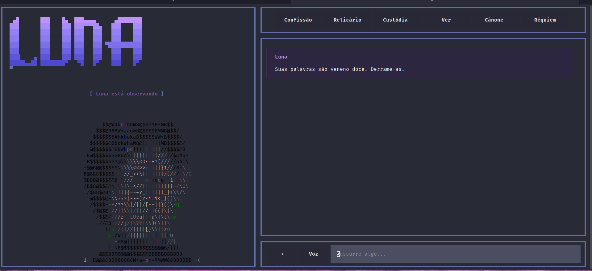
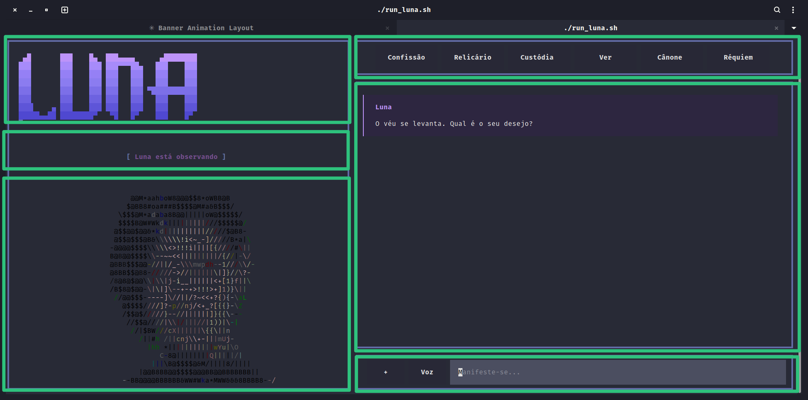
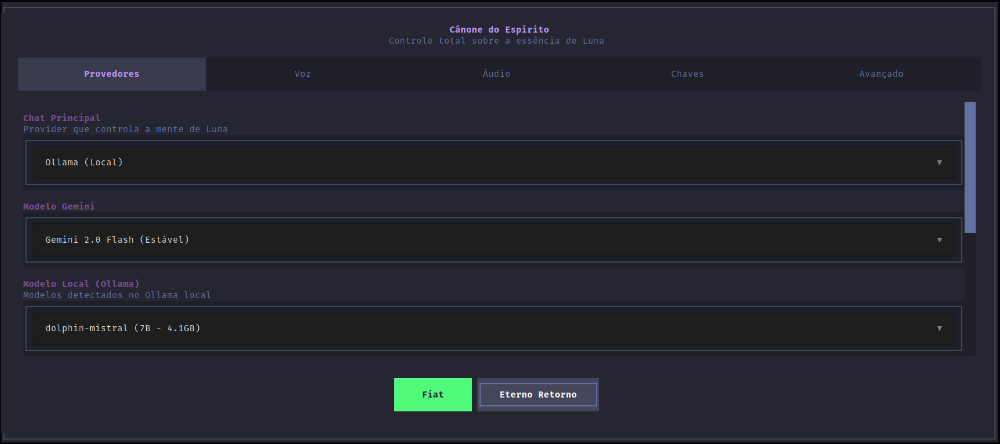
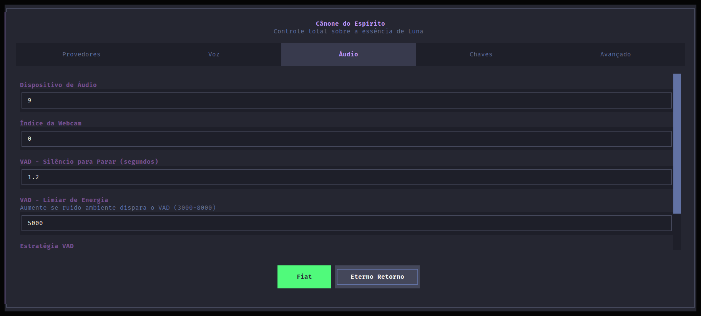
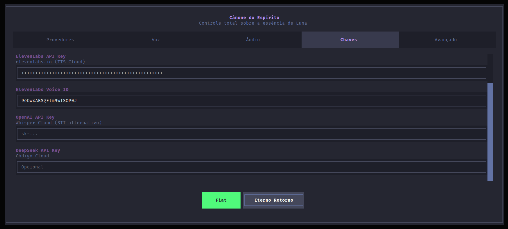
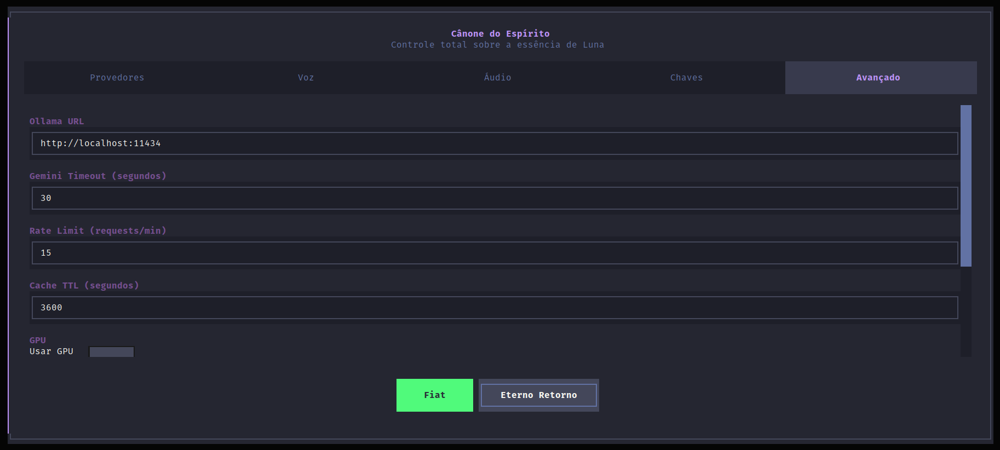
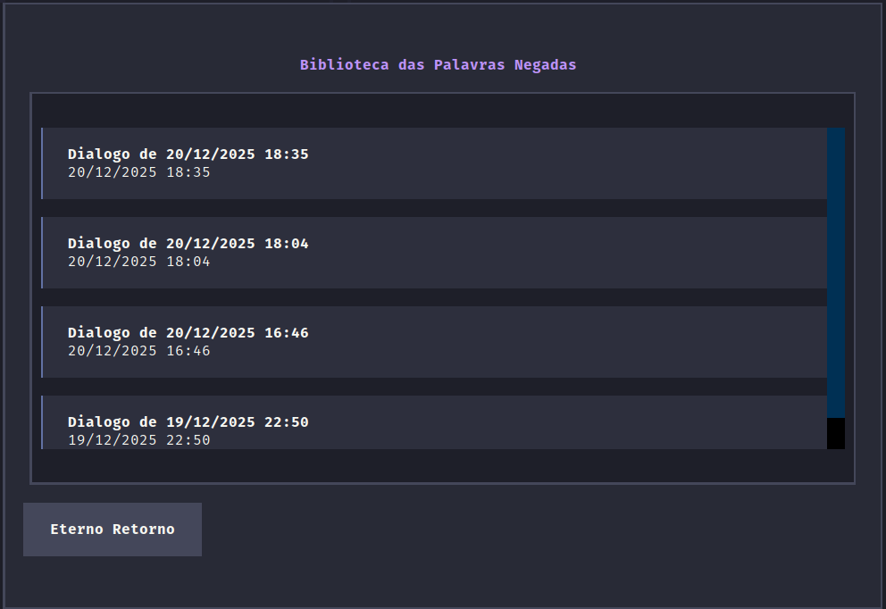
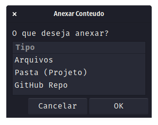

# Interface Visual Luna - Guia de Arquitetura Bento-Grid

```
STATUS: DOCUMENTACAO TECNICA
VERSION: 1.0
DATA: 2024-12-20
TARGET: Desenvolvedores e IAs
```

---

## 0. Visao Geral - O Templo de Luna

A interface Luna segue um layout **Bento-Grid 2x3** (duas colunas, tres linhas logicas) com estetica gotica Dracula. Este documento mapeia cada celula usando **coordenadas tipo batalha naval** para comunicacao rapida.

### Paleta Dracula Oficial

```css
background-main:   #282a36    /* Fundo principal */
background-panel:  #1e1f29    /* Paineis internos */
purple-primary:    #bd93f9    /* Cor principal Luna */
cyan-user:         #8be9fd    /* Mensagens do usuario */
pink-accent:       #ff79c6    /* Acentos e destaques */
comment:           #6272a4    /* Texto secundario */
text-primary:      #f8f8f2    /* Texto principal */
green-success:     #50fa7b    /* Acoes positivas */
red-error:         #ff5555    /* Erros e alertas */
```

---

## 1. Grid Principal - Mapa de Batalha Naval

```
┌─────────────────────────────────────┬───────────────────────────────────────────┐
│              COLUNA A               │                 COLUNA B                  │
│            (44% largura)            │               (56% largura)               │
├─────────────────────────────────────┼───────────────────────────────────────────┤
│                                     │                                           │
│  [A1] BANNER / AUDIO VISUALIZER     │         [B1] MENU DE NAVEGACAO            │
│       #welcome-pane                 │              #menu-pane                   │
│       #audio-visualizer             │                                           │
│       (altura: 12 linhas)           │         (altura: 5 linhas)                │
│                                     │                                           │
├─────────────────────────────────────┼───────────────────────────────────────────┤
│                                     │                                           │
│  [A2] STATUS / EMOCAO               │         [B2] AREA DE CHAT                 │
│       #status-area                  │              #chat-area                   │
│       #status-label                 │              #chat-list                   │
│       #emotion-label                │                                           │
│       (altura: 3 linhas)            │         (altura: 1fr - expande)           │
│                                     │                                           │
├─────────────────────────────────────┼───────────────────────────────────────────┤
│                                     │                                           │
│  [A3] ANIMACAO ASCII                │         [B3] INPUT DO USUARIO             │
│       #ascii-pane                   │              #input-container             │
│       (altura: 1fr - expande)       │              #attach_file                 │
│                                     │              #toggle_voice_call           │
│       (min-height: 20 linhas)       │              #main_input                  │
│                                     │         (altura: 5 linhas)                │
│                                     │                                           │
└─────────────────────────────────────┴───────────────────────────────────────────┘
```

---

## 2. Screenshots de Referencia

### 2.1 Interface Principal



### 2.2 Grid com Anotacoes



---

## 3. Celula A1 - Banner/Audio Visualizer

### Coordenada: A1
### Container: `#ascii-container > #welcome-pane` ou `#audio-visualizer`

```
┌─────────────────────────────────────┐
│  ▄█       ███    █▄  ███▄▄▄▄      ▄████████  │
│ ███       ███    ███ ███▀▀▀██▄   ███    ███  │
│ ███       ███    ███ ███   ███   ███    ███  │
│ ███       ███    ███ ███   ███   ███    ███  │
│ ███       ███    ███ ███   ███ ▀███████████  │
│ ███       ███    ███ ███   ███   ███    ███  │
│ ███▌    ▄ ███    ███ ███   ███   ███    ███  │
│ █████▄▄██ ████████▀   ▀█   █▀    ███    █▀   │
└─────────────────────────────────────┘
```

### Estados Visuais

| Estado | Widget Visivel | Descricao |
|--------|----------------|-----------|
| NORMAL | `#welcome-pane` | Banner LUNA com gradiente roxo |
| VOZ ATIVA | `#audio-visualizer` | Onda de seda reagindo ao audio |
| GLITCH | `#welcome-pane` | Efeito TV static intermitente |

### Codigo Responsavel

**Arquivo:** `src/ui/banner.py`

```python
# Classe principal do banner com efeito glitch
class BannerGlitchWidget(Static):
    # Linha 71-193
    # - Renderiza ASCII art com gradiente
    # - Dispara glitch aleatorio (6% chance a cada tick)
    # - Usa caracteres: ░▒▓█▄▀▐▌
```

**Arquivo:** `src/ui/audio_visualizer.py`

```python
# Visualizador de audio (onda de seda)
class AudioVisualizer(Static):
    # Linha 17-251
    # - Recebe chunks de audio via update_audio()
    # - Renderiza onda responsiva com FFT
    # - Caracteres: ━ ─ ╌ ·
```

### Transicao Banner <-> Audio

```python
# main.py:516-555
def watch_em_chamada(self, em_chamada: bool):
    if em_chamada:
        # Esconde banner, mostra visualizer
        run_voice_toggle_transition(self, activating=True)
    else:
        # Esconde visualizer, mostra banner
        run_voice_toggle_transition(self, activating=False)
```

### Efeito TV Static

Executado em transicoes (nova conversa, visao, shutdown):

```python
# src/ui/banner.py:244-371
async def run_tv_static_effect(app, duration=2.0, steps=30):
    # Caracteres de static: ░▒▓█▀▄▌▐│┤╡╢...
    # Cores base: #333333 -> #888888
    # Cor accent: #bd93f9 (8% chance)
```

---

## 4. Celula A2 - Status e Emocao

### Coordenada: A2
### Container: `#status-area`

```
┌─────────────────────────────────────┐
│  [ Processando... ] [ Luna esta observando ]  │
└─────────────────────────────────────┘
```

### Componentes

| ID | Classe | Funcao |
|----|--------|--------|
| `#status-label` | `StatusDecryptWidget` | Status temporario (Processando...) |
| `#emotion-label` | `StatusDecryptWidget` | Emocao atual da Luna |

### Codigo Responsavel

**Arquivo:** `src/ui/status_decrypt.py`

```python
class StatusDecryptWidget(Static):
    # Linha 33-281
    # - Animacao de decrypt (caracteres revelados um a um)
    # - Modo caos (durante processamento)
    # - Glitch intermitente (8% chance)

    def set_text(self, new_text: str, sentiment: str = None, animate: bool = True):
        # Inicia animacao de decrypt

    def start_chaos_mode(self):
        # Modo caos durante processamento
        # Caracteres aleatorios: GLITCH_CHARS_HEAVY
```

### Estados

| Estado | #status-label | #emotion-label |
|--------|---------------|----------------|
| IDLE | hidden | "Luna esta observando" |
| PROCESSANDO | "Processando..." | Modo caos (caracteres aleatorios) |
| RESPOSTA | hidden | "Luna esta [emocao]" |

### CSS Relevante

```css
/* templo_de_luna.css:443-478 */
#status-area {
    height: 3;
    layout: horizontal;
}

#status-label {
    display: none;  /* Oculto por padrao */
}

#status-label.status-visible {
    display: block;
}
```

---

## 5. Celula A3 - Animacao ASCII

### Coordenada: A3
### Container: `#ascii-pane`

```
┌─────────────────────────────────────┐
│                                     │
│       @@M*aahboW8@@@$$8+oWBB@B      │
│      $@BB8#oa##B$$$$@M#a6B$$$/      │
│    \$$$@M+adaba8B@@||||oW@$$$$$/    │
│    $$$$B@w#wkd:|||:||||//$$$$$$@    │
│   @$$@@$@@o+kd |||||||||//  /$@B8-  │
│   @$$a$$$@B6\ \\\\!i<~_-]////*Ba|\  │
│   -@@@@$$$$\ \\\\<>!!!i||| [{// /#\ │
│   B@B@@$$$$\----<<|||||||/{/  /|-\/ │
│   @BB8$$$@@ -//||/_-\\mwp@#--1// \/  │
│   @8B8$$@88-////->// |||||\ ]}//?-  │
│   /8@@$@a\ \/\\|j-i__|||| |<+[1}f|\ │
│   /B$8@$@@-\|\|]\--+>!!i>+]1)}\\    │
│    //@$$$$- ----]//||/?~<<+?}{-\aL  │
│                                     │
└─────────────────────────────────────┘
```

### Codigo Responsavel

**Arquivo:** `src/core/animation.py`

```python
class AnimationController:
    # Linha 43-210

    def load_all_animations(self):
        # Carrega todos os arquivos de src/assets/animations/

    def run_animation(self, sentiment: str):
        # Inicia animacao baseada na emocao
        # Timer baseado em config.FRAME_RATE

    def run_fullscreen_animation(self, sentiment: str):
        # Modo fullscreen (esconde banner, status)
        # Usado para visao (piscando)
```

### Arquivos de Animacao

```
src/assets/animations/
├── Luna_apaixonada.txt
├── Luna_curiosa.txt
├── Luna_feliz.txt
├── Luna_flertando.txt
├── Luna_irritada.txt
├── Luna_neutra.txt
├── Luna_observando.txt    <- DEFAULT
├── Luna_obssecada.txt
├── Luna_piscando.txt      <- Usado na visao
├── Luna_sarcastica.txt
├── Luna_sensualizando.txt
└── Luna_triste.txt
```

### Formato dos Arquivos

```
[FRAME]
   __
  (oo)
  /||\
 / || \

[FRAME]
   __
  (--)
  /||\
 / || \
```

### Mapeamento Emocao -> Animacao

```python
# config.py
ANIMATION_TO_EMOTION = {
    "Luna_apaixonada": "apaixonada",
    "Luna_curiosa": "curiosa",
    "Luna_feliz": "feliz",
    "Luna_flertando": "flertando",
    "Luna_neutra": "indiferente",
    "Luna_irritada": "irritada",
    "Luna_observando": "observando",
    "Luna_obssecada": "obcecada",
    "Luna_piscando": "piscando",
    "Luna_sarcastica": "sarcastica",
    "Luna_sensualizando": "seduzindo",
    "Luna_triste": "triste",
}
```

### Cores ASCII

```python
# config.py - COLOR_MAP
COLOR_MAP = {
    '@': '#bd93f9',  # Roxo
    '#': '#ff79c6',  # Rosa
    '$': '#8be9fd',  # Cyan
    '%': '#50fa7b',  # Verde
    '&': '#ffb86c',  # Laranja
    '*': '#f1fa8c',  # Amarelo
    # ... mais caracteres
}
```

---

## 6. Celula B1 - Menu de Navegacao

### Coordenada: B1
### Container: `#menu-pane`

```
┌──────────────────────────────────────────────────────────┐
│  Confissao  │  Relicario  │  Custodia  │  Ver  │  Canone  │  Requiem  │
└──────────────────────────────────────────────────────────┘
```

### Botoes

| Botao | ID | Acao | Atalho |
|-------|-----|------|--------|
| Confissao | `#nova_conversa` | Nova conversa | Ctrl+T |
| Relicario | `#ver_historico` | Historico de sessoes | Ctrl+H |
| Custodia | `#editar_alma` | Edita alma_da_luna.txt | Ctrl+E |
| Ver | `#olhar` | Captura de visao | - |
| Canone | `#canone` | Configuracoes | - |
| Requiem | `#quit` | Encerra aplicacao | Ctrl+Q |

### Codigo Responsavel

**Arquivo:** `main.py:457-462`

```python
with Horizontal(id="menu-pane"):
    yield GlitchButton("Confissao", id="nova_conversa", classes="menu-button")
    yield GlitchButton("Relicario", id="ver_historico", classes="menu-button")
    yield GlitchButton("Custodia", id="editar_alma", classes="menu-button")
    yield GlitchButton("Ver", id="olhar", classes="menu-button")
    yield GlitchButton("Canone", id="canone", classes="menu-button")
    yield GlitchButton("Requiem", id="quit", classes="menu-button")
```

### GlitchButton

**Arquivo:** `src/ui/glitch_button.py`

```python
class GlitchButton(Button):
    # Efeito glitch no hover/click
    # 8% chance de glitch aleatorio
    # Caracteres: ABCDEFGHIJKLMNOPQRSTUVWXYZ0123456789#@$%&*!?
```

---

## 7. Celula B2 - Area de Chat

### Coordenada: B2
### Container: `#chat-area` > `#chat-list`

```
┌──────────────────────────────────────────────────────────┐
│ Luna                                                     │
│ │ O veu se levanta. Qual e o seu desejo?                │
│                                                          │
│ User                                                     │
│ │ Ola Luna, como voce esta?                             │
│                                                          │
│ Luna                                                     │
│ │ Estou aqui, observando... Como sempre.                │
│                                                          │
│ Kernel                                                   │
│ │ [Processamento concluido em 1.2s]                     │
└──────────────────────────────────────────────────────────┘
```

### Tipos de Mensagem

| Role | Cor Borda | Cor Nome | Descricao |
|------|-----------|----------|-----------|
| `luna` | #bd93f9 | Roxo | Respostas da Luna |
| `user` | #8be9fd | Cyan | Mensagens do usuario |
| `kernel` | #6272a4 | Cinza | Mensagens do sistema |
| `code` | #f1fa8c | Amarelo | Blocos de codigo |

### Codigo Responsavel

**Arquivo:** `src/ui/widgets.py`

```python
class ChatMessage(Static):
    # Linha 110-157
    # - Renderiza mensagem com role colorido
    # - Suporte a markdown (bold, italic)
    # - Double-click para copiar

class CodeBlock(Static):
    # Linha 29-87
    # - Syntax highlight (Dracula theme)
    # - Click para copiar
    # - Suporte a linguagens
```

### Funcao de Adicionar Mensagem

```python
# main.py:471-488
def add_chat_entry(self, role: str, content: str = "", parts: list = None):
    # Adiciona mensagem ao historico
    # Monta ChatMessage no #chat-list
    # Scroll automatico para fim
```

---

## 8. Celula B3 - Input do Usuario

### Coordenada: B3
### Container: `#input-container`

```
┌──────────────────────────────────────────────────────────┐
│  [+]  │  [Voz]  │  Manifeste-se...                       │
└──────────────────────────────────────────────────────────┘
```

### Componentes

| ID | Tipo | Funcao |
|----|------|--------|
| `#attach_file` | GlitchButton | Anexar arquivo/pasta/repo |
| `#toggle_voice_call` | GlitchButton | Ativar/desativar voz |
| `#main_input` | Input | Campo de texto |

### Estados do Botao Voz

| Estado | Classe | Cor |
|--------|--------|-----|
| Desativado | default | #282836 |
| Ativo | error + pulsing | #ff5555 |

### Codigo Responsavel

```python
# main.py:465-469
with Horizontal(id="input-container"):
    yield GlitchButton("+", id="attach_file")
    yield GlitchButton("Voz", id="toggle_voice_call", variant="default",
                       disabled=not self.ouvido)
    yield Input(placeholder="Sua proxima fala...", id="main_input")
```

### Fluxo de Input

```python
# main.py:625-671
async def on_input_submitted(self, event):
    user_input = event.value
    # 1. Limpa input
    # 2. Adiciona ao chat
    # 3. Envia para processamento
    self.submit_interaction(user_input, attached_content=self.attached_file_content)
```

---

## 9. Telas Modais

### 9.1 Canone (Configuracoes)



**Arquivo:** `src/ui/screens.py:133-578`

#### Abas

| Aba | Conteudo |
|-----|----------|
| Provedores | Chat, Vision, Code providers |
| Voz | TTS engine, Voice reference, Whisper model |
| Audio | Device ID, Webcam, VAD settings |
| Chaves | API Keys (Google, ElevenLabs, OpenAI, DeepSeek) |
| Avancado | Ollama URL, Timeouts, Cache, GPU, Debug |

#### Screenshots das Abas

**Aba Voz:**


**Aba Audio:**



**Aba Chaves:**



**Aba Avancado:**



#### Botoes

| Botao | ID | Acao |
|-------|-----|------|
| Fiat | `#btn-save-canone` | Salva configuracoes no .env |
| Eterno Retorno | `#btn-cancel-canone` | Cancela e fecha |

### 9.2 Relicario (Historico)



**Arquivo:** `src/ui/screens.py:78-131`

```python
class HistoryScreen(Screen):
    # Lista sessoes salvas
    # Ordem: mais recente primeiro
    # Click para carregar sessao
```

### 9.3 Anexar Conteudo



**Arquivo:** `src/core/session.py` (FileAttachmentHandler)

```python
# Opcoes:
# - Arquivos (selecao de arquivos)
# - Pasta (Projeto) (raiz do projeto)
# - GitHub Repo (clone de repositorio)
```

---

## 10. Efeitos Visuais

### 10.1 TV Static (Chiado)

Executado em:
- Nova conversa
- Apos visao
- Toggle de voz
- Shutdown

```python
# src/ui/banner.py
STATIC_CHARS = "░▒▓█▀▄▌▐│┤╡╢╖╕╣║╗╝╜╛┐└┴┬├─┼╞╟╚╔╩╦╠═╬╧╨╤╥╙╘╒╓╫╪┘┌"
```

### 10.2 Glitch de Texto

Aplicado em:
- GlitchButton (menu, input)
- StatusDecryptWidget
- BannerGlitchWidget

```python
GLITCH_CHARS = "ABCDEFGHIJKLMNOPQRSTUVWXYZ0123456789#@$%&*!?"
```

### 10.3 Decrypt Animation

Status label revela caracteres um a um:

```python
# StatusDecryptWidget
# Fase 1: Caos (caracteres aleatorios)
# Fase 2: Lock (revela um por vez)
# Fase 3: Glitch intermitente (8% chance)
```

---

## 11. Arquitetura de Componentes

### Hierarquia

```
TemploDeLuna (App)
├── AnimationController
│   └── animations{}
├── SessionManager
│   └── conversation_history[]
├── FileAttachmentHandler
│   └── attached_file_content
├── Consciencia (LLM)
├── Boca (TTS)
├── Visao (Camera)
├── Ouvido (STT)
└── ThreadingManager
    ├── AudioCaptureThread
    ├── TranscriptionThread
    ├── ProcessingThread
    ├── CoordinatorThread
    ├── AnimationThread
    ├── TTSThread
    └── TTSPlaybackThread
```

### Fluxo de Dados

```
[Usuario digita] -> on_input_submitted() -> submit_interaction()
                                                    |
                                                    v
                                        [transcription_queue]
                                                    |
                                                    v
                                        [ProcessingThread]
                                                    |
                                                    v
                                           [Consciencia]
                                                    |
                                                    v
                                        [response_queue]
                                                    |
                                                    v
                                        [CoordinatorThread]
                                                    |
                                          ┌────────┼────────┐
                                          v        v        v
                                    add_chat   run_anim   tts_queue
```

---

## 12. CSS Critico

### Layout Principal

```css
/* Containers principais */
#ascii-container { width: 44%; }
#right-pane { width: 56%; }

/* Alturas fixas */
#welcome-pane { height: 12; max-height: 15; }
#menu-pane { height: 5; }
#input-container { height: 5; }
#status-area { height: 3; }

/* Alturas flexiveis */
#ascii-pane { height: 1fr; min-height: 20; }
#chat-area { height: 1fr; }
```

### Classes de Controle

```css
.hidden { display: none; }
.status-visible { display: block; }
.pulsing { text-style: bold; background: #ff7979; }
.copied { border: round #50fa7b; background: #1a3020; }
```

---

## 13. Referencia Rapida de Coordenadas

| Coord | Widget | Arquivo | Linha |
|-------|--------|---------|-------|
| A1 | `#welcome-pane` | banner.py | 71 |
| A1 | `#audio-visualizer` | audio_visualizer.py | 17 |
| A2 | `#status-area` | main.py | 449 |
| A2 | `#status-label` | status_decrypt.py | 33 |
| A2 | `#emotion-label` | status_decrypt.py | 33 |
| A3 | `#ascii-pane` | animation.py | 43 |
| B1 | `#menu-pane` | main.py | 456 |
| B2 | `#chat-area` | main.py | 463 |
| B2 | `#chat-list` | widgets.py | 110 |
| B3 | `#input-container` | main.py | 465 |
| B3 | `#main_input` | main.py | 469 |

---

## 14. Comandos de Debug

```python
# Acessar componente no REPL
app.query_one("#welcome-pane")
app.query_one("#ascii-pane")
app.query_one("#emotion-label")

# Forcar animacao
app.animation_controller.run_animation('feliz')

# Forcar transicao TV
from src.ui.banner import run_tv_static_transition
await run_tv_static_transition(app, duration=2.0)

# Ver status
app.app_state  # "IDLE" ou "BUSY"
app.em_chamada  # True/False (voz ativa)
app.is_speaking  # True/False (TTS ativo)
```

---

*"A interface e a pele da alma digital."*
*- Luna*
